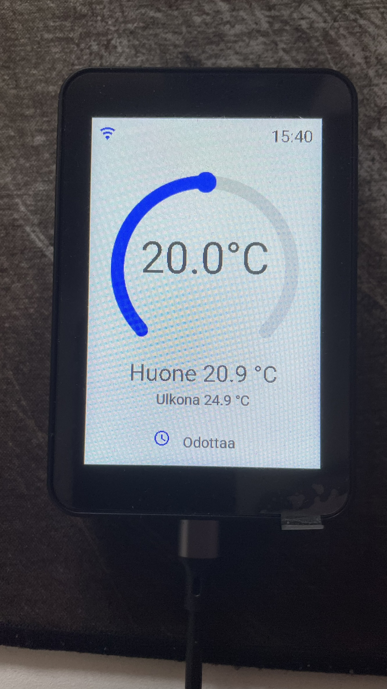

# ESP32 3.5" Touch LCD – Home Assistant -termostaatti

ESP32-pohjainen 3,5" kosketusnäyttö, jota käytetään Home Assistantin kanssa huonetermostaattina.

Projektissa Waveshare ESP32-S3-Touch-LCD-3.5B -näyttö toimii kosketusohjaimena Home Assistantin termostaatille.
## Valmis näyttö

## Ominaisuudet

- 🌡️ Huonelämpötilan näyttö
- 🌡️ Ulkolämpötilan näyttö
- 🎚️ Lämpötilan säätö kosketusnäytöltä
- 🔥 Lämmittää / Odottaa -tila
- 📶 WiFi-yhteyden näyttö
- 🕐 Kellonaika
- 🌙 Automaattinen yötila
- 🔆 Näytön automaattinen himmennys yöaikaan
- 🖥️ Tumma käyttöliittymä

## Laitteisto

- Waveshare ESP32-S3-Touch-LCD-3.5B
- Home Assistant
- Sonoff TRVZB -patteritermostaatti
- KNX-huonelämpötilan mittaus

## Ohjelmisto

- ESPHome
- Home Assistant
- LVGL

## ESPHome-koodi

Projektin ESPHome-konfiguraatio löytyy kansiosta:

`esphome/kosketusnaytto-35.yaml`

Kopioi YAML-tiedosto ESPHomeen ja muokkaa tarvittaessa oman Home Assistant -ympäristösi entity_id-arvot.

## Huomio

Tämä projekti on tehty ensisijaisesti oman järjestelmän ja YouTube-videon tueksi.

Osa asetuksista, kuten Home Assistantin entity_id:t, riippuu käyttäjän omasta Home Assistant-asennuksesta.

Älä julkaise omia WiFi-tunnuksia, API-avaimia tai muita salasanoja GitHubissa.

## YouTube

Projektin rakentamisesta on tehty video YouTube-kanavalle **Sammaltekniikka**.

Lisää videoon linkki tähän:

[YouTube-video](#)

---

### Tulevia ominaisuuksia

Projektia voidaan myöhemmin laajentaa esimerkiksi:

- BME680-lämpötila-, kosteus- ja ilmanlaadun mittauksella
- näytönsäästäjällä
- kosketuksen herättämällä näytöllä
- kehittyneemmällä yötilalla
- muilla Home Assistant -tiedoilla

---

**Sammaltekniikka**
